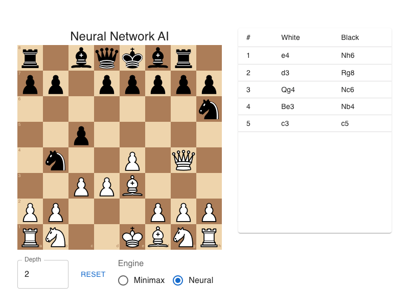

# Chess AI Backend

This repository implements a Chess AI backend with two engines:

- **Minimax**: search-based engine with alpha-beta pruning and quiescence search.
- **Neural**: evaluation using a trained convolutional neural network.



## Repository Structure

```
backend/
  app.py                   Flask application and API endpoints
  chess_engine.py          Minimax implementation and evaluation logic
  neural_model.py          Neural network architecture and serialization utilities
  generate_training_set.py PGN processing to dataset
  train_model.py           Training script for neural network
  data/                    Source PGN files (not tracked)
  processed/               Processed datasets (not tracked)
  nets/                    Trained model weights (not tracked)
  requirements.txt         Python dependencies
```

## Setup

1. Create and activate a virtual environment:
   ```
   python3 -m venv venv
   source venv/bin/activate
   ```
2. Install dependencies:
   ```
   pip install -r requirements.txt
   ```
3. Configure environment variables in `.env`:
   ```
   FLASK_SECRET_KEY=<your secret>
   GOOGLE_OAUTH_CLIENT_ID=<client id>
   GOOGLE_OAUTH_CLIENT_SECRET=<client secret>
   ```
   Add `.env` to `.gitignore`.

## Usage

### Generating Dataset

Place PGN files in `data/` and run:

```
python generate_training_set.py
```

Datasets will be saved in `processed/`.

### Training Neural Model

```
python train_model.py
```

Model weights are written to `nets/value.pth`.

### Running the API

```
python app.py
```

The API will be available at `http://localhost:5001/`.

## API Endpoints

### POST /api/chess/move

Request:

```json
{
  "fen": "<FEN string>",
  "depth": <search depth>,
  "engine": "minimax" | "neural"
}
```

Response:

```json
{ "move": "<uci string>" }
```

## Authentication

Google OAuth2 is used for user login. Ensure the redirect URI in Google Console matches `GOOGLE_REDIRECT_URI` in `.env`.

## Notes

- Minimax search depth impacts performance exponentially.
- The neural engine offers consistent response time but depends on GPU availability.
- For production, use Gunicorn or Docker and set `FLASK_ENV=production`.
